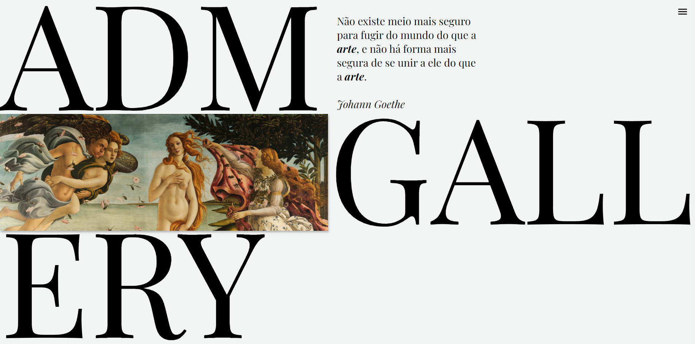

<h1 align="center"> ADM Gallery </h1>

    

# Sobre o Projeto

Projeto de capacitação em React e Ruby on Rails criado pela Diretoria Administrativa - Financeira da Struct e concluído em 17 de agosto de 2021. Essa capacitação ocorreu devido a transição no uso de Rails Full-Stack para o uso da biblioteca React (front-end) em conjunto com Ruby on Rails (back-end).

O projeto ADM Gallery tem como objetivo a democratização do acesso à arte, fornecendo um pletora de diversas pinturas de diferentes décadas e artistas, junto com informações e curiosidades sobre as obras mais celebradas da história. Para a inclusão ou remoção do conteúdo visual das páginas, o site possui uma página de Login e Logout para o acesso do administrador.

Para acessar o site completo será necessário fazer uso do front-end em React localizada em [adm_gallery-site](https://github.com/StructCE/adm_gallery-site). 

## Membros responsáveis pelo projeto:
* [André Macedo](https://github.com/andremacedopv)
* [David Mendes](https://github.com/DavidsonGM)
* [Nícolas Paulin](https://github.com/iIiqwertyiIi)

# Requisitos e ferramentas utilizadas

- [Ruby](https://www.ruby-lang.org/pt/downloads/) (v2.7.2)
- [Rails](https://guides.rubyonrails.org/) (v6.0.3)
- [Git](https://git-scm.com/downloads)
- [PostgreSQL](https://www.postgresql.org/download/)

# Como clonar e rodar o projeto em sua máquina

### `git clone https://github.com/StructCE/adm_gallery-api.git`

Clona o repositório para uso local em seu computador.

### `bundle` ou `bundle install`

Instala todas as dependências e gems do arquivo Gemfile necessários para o rodar o projeto rails.

### `rails db:reset`

Derruba o banco de dados e cria um novo 

### `rails s`

Inicializa o servidor Rails.

O servidor por padrão será aberto em [http://localhost:3000](http://localhost:3000).

Para abrir o servidor em outra porta use `rails s -p <port>`
